# Hexagon Grid Generator
Work in progress. <br>
Allows dynamic creation of hexagon cell grids in different shapes and configurations. <br>
Comes with functions to create a grid generator that shows configuration changes in real time. <br>

## Grid Shapes
### Hexagon Shape
- Flat top grid (hexFlatLayout)
    <details>
    <summary>Example</summary>
    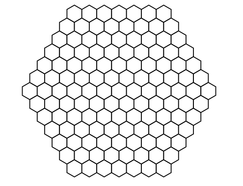 <br>
  </details>
- Pointy top grid (hexPointyLayout)
    <details>
    <summary>Example</summary>
    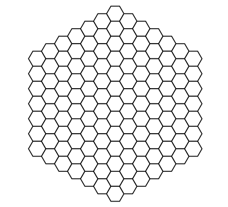 <br>
  </details>
### Triangle Shape
- Pointing Up (triangleUp)
  <details>
  <summary>Example</summary>
    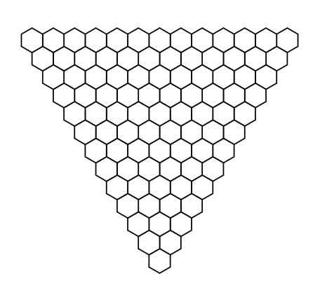 <br>
  </details>
- Pointing Down (triangleDown)
    <details>
    <summary>Example</summary>
    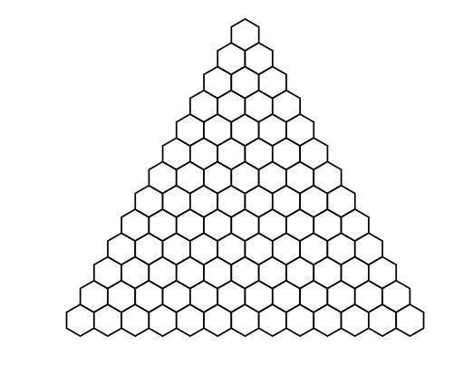 <br>
  </details>
- Pointing Left (triangleLeft)
    <details>
    <summary>Example</summary>
    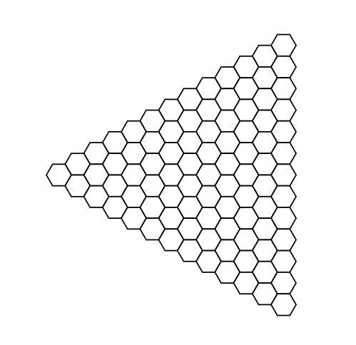 <br>
  </details>
- Pointing Right (triangleRight)
    <details>
    <summary>Example</summary>
    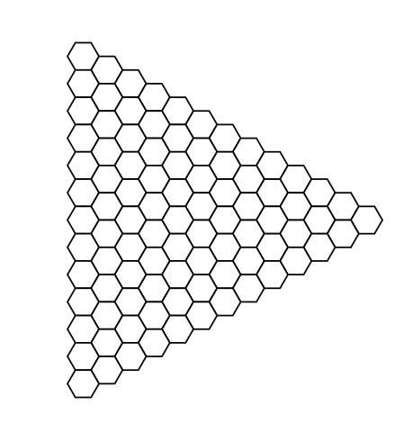 <br>
  </details>


## How to create grid (without visual render)

### Grid Creation
#### Step 1: Decide what grid type you want.
This will be the overall shape of the grid that your hexagon cells form. <br>
Keep in mind which type you want, it will be used later. <br>
<details>
<summary>Grid Types</summary>
<ul>
<li>Hexagon Shaped Grid
    <details>
    <summary>Example</summary>
     <br>
  </details>
<li>Triangle Shaped Grid
    <details>
    <summary>Example</summary>
     <br>
  </details>
</ul>
</details>

_______


#### Step 2: Decide what orientation you want your grid to be.
This will be the overall orientation of the cells and which direction the individual cells point towards. <br>
The information is kept in already created Orientation class objects, though you can make your own.
Keep in mind which orienation you want, it will be used later. <br>
<details>
<summary>Grid Orientations</summary>

```javascript
class Orientation {
    constructor(f0, f1, f2, f3, b0, b1, b2, b3, startAngle) {
      this.f0 = f0;
      this.f1 = f1;
      this.f2 = f2;
      this.f3 = f3;
      this.b0 = b0;
      this.b1 = b1;
      this.b2 = b2;
      this.b3 = b3;
      this.startAngle = startAngle;
    }
}
```

<h4>Hexagon Shape </h4>
<ul>
<li>Flat top grid (hexFlatLayout)
    <details>
    <summary>Example</summary>
     <br>
  </details>
<li>Pointy top grid (hexPointyLayout)
    <details>
    <summary>Example</summary>
     <br>
  </details>
</ul>
<h4>Triangle Shape</h4>
<ul>
<li>Pointing Up (triangleUp)
  <details>
  <summary>Example</summary>
     <br>
  </details>
<li>Pointing Down (triangleDown)
    <details>
    <summary>Example</summary>
     <br>
  </details>
<li>Pointing Left (triangleLeft)
    <details>
    <summary>Example</summary>
     <br>
  </details>
<li>Pointing Right (triangleRight)
    <details>
    <summary>Example</summary>
     <br>
  </details>
</ul>
</details>

_______ 

#### Step 3: Decide what cell size you want.
This will be the total size of the individual cells that make up the grid by choosing the width (x) and height (y). <br>
They can be uneven. <br>
The information is kept in a Point class object. <br>
It's up to you whether you want to store the Point class object as an independent variable or not. <br>

<details>
<summary>Examples & Usage</summary>

```javascript
class Point {
    constructor(x, y) {
      this.x = x;
      this.y = y;
    }
}
```
X = The width of the cell. <br>
Y = The height of the cell. <br>
  
_______ 
   
Here is an example of creating a cell that is evenly shaped as a variable. <br>

```javascript
const exampleCell = new Point(10, 10)
```


_______ 
   
Here is an example of creating a cell that is unevenly shaped as a variable. <br>

```javascript
exampleCell = new Point(20, 10)
```

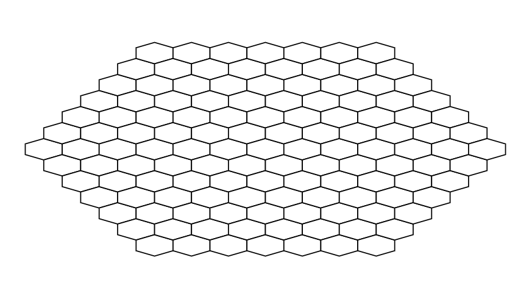

</details>

_______ 

#### Step 4: Decide where the origin point of the grid will be. <br>
This is the location of where the first cell is created and therefore the origin point of the grid. <br>
Typically this is the centre of the created grid but not for all grid types. <br>
Look at the examples to check how that might change where you want to place your origin point. <br>
<br>
The location of the origin point is decided by (X) and (Y) coordinates in a Point class object. <br>
If you want the origin point to be dead centre of where you are visually rendering your grid, you would take the width and height of where you are visually rendering your grid then divide it by 2. <br>
So if you have an SVG that is 500(X) x 600(Y), the Point class object would be 250(X) & 300(Y), for the origin point to be rendered in the centre. <br>

<details>
<summary>Examples & Usage</summary>

```javascript
class Point {
    constructor(x, y) {
      this.x = x;
      this.y = y;
    }
}
```
X = The X (horizontal) coordinates of the origin point. <br>
Y = The Y (vertical) coordinates of the origin point. <br>

_______ 

Here is an example of a hex shaped grid with its origin point centred. <br>

```javascript
const exampleOriginPoint = new Point(250, 250)
```

Hexagon Shaped Grid (SVG (500 x 500) / Origin Point (250 x 250))<br>
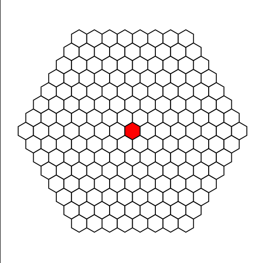

_______ 

Here is an example of a triangle shaped grid with its origin point centred. <br>

```javascript
const exampleOriginPoint = new Point(250, 250)
```

Triangle Shaped Grid (SVG (500 x 500) / Origin Point (250 x 250))<br>
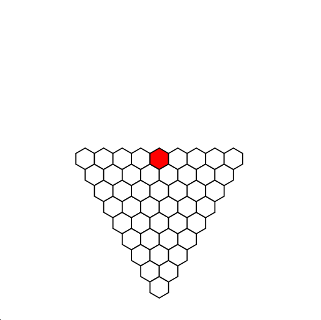

_______ 

Here is an example of a hexagon shaped grid with its origin point to the left. <br>

```javascript
const exampleOriginPoint = new Point(250, 100)
```

Hexagon Shaped Grid (SVG (500 x 500) / Origin Point (250 x 100))<br>
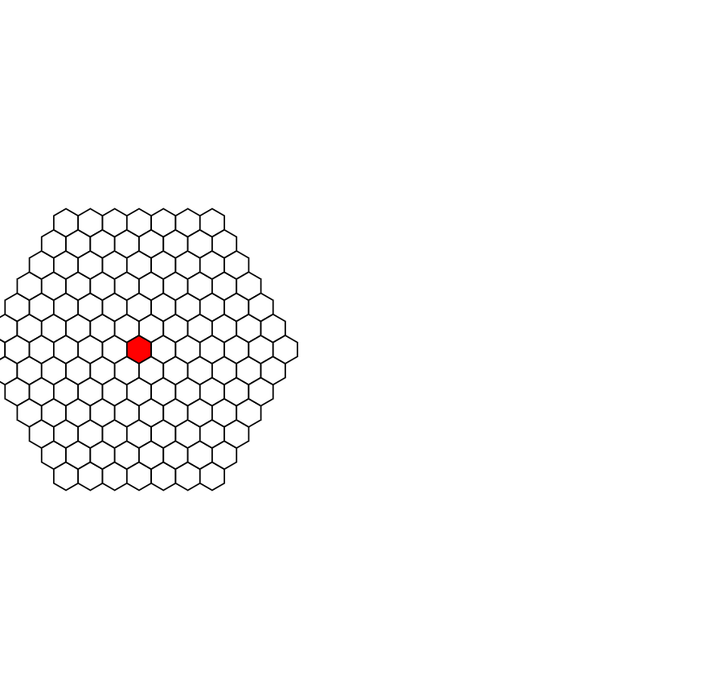

</details>

<details>
<summary>Centring Triangle Grid Example</summary>
SVG (500 x 500) / Origin Point (250 x 250) <br>
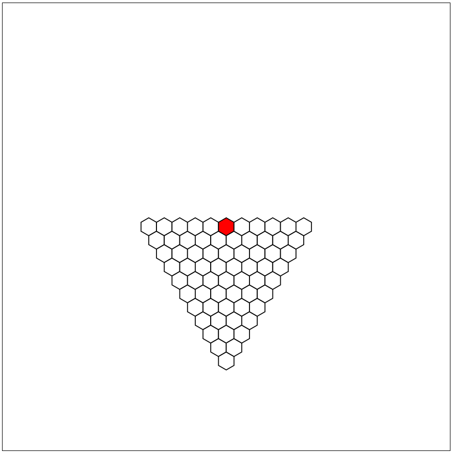

_______ 


SVG (500 x 500) / Origin Point (250 x 180) <br>


</details>

_______ 

#### Step 5: Aggregate orientation, cell size and origin point for future use <br>
Now aggregate the orientation, cell size and origin point in a Layout class object.


<details>

```javascript
class Layout {
    constructor(orientation, size, origin) {
        this.orientation = orientation;
        this.size = size;
        this.origin = origin;
    }
}
```

Take the orientation you have chosen for the grid you have picked and put it as the first argument. <br>
In this example, the Hexagon shaped grid has been chosen in the Flat Top orientation. <br>

```javascript
const exampleLayout = new Layout(hexFlatLayout, size, origin)
```

Now take the Point class object variable which represents the cell size that you created in Step 3, or create one in the exampleLayout variable.<br>

IF we use the example variable created in Step 3, which looks like this: <br>

```javascript
const exampleCell = new Point(10, 10)
```

Then it would look like this: <br>

```javascript
const exampleLayout = new Layout(hexFlatLayout, exampleCell, origin)
```

IF you want to not use an independent variable and just create one in the class, it looks like this: <br>

```javascript
const exampleLayout = new Layout(hexFlatLayout, new Point(10, 10), origin)
```

Continuing on with the assumption that exampleCell was used. <br>

Now take the Point class object variable which represents the origin point that you created in Step 4, or create one in the exampleLayout variable. <br>

```javascript
const exampleOriginPoint = new Point(250, 250)
```

IF we use the example variable created in Step 4, which looks like this: <br> 

```javascript
const exampleLayout = new Layout(hexFlatLayout, exampleCell, exampleOriginPoint)
```

Congratulations, you now have your layout. <br>
</details>


### Step 6 : Grid Creation
Now create the grid, we can add visual rendering later. <br>
This is done with a function that creates a JavaScript Map object. <br>
The Map object contains a key value pair for each cell in the grid. <br>
The value contains:
<ol>
<li>An object called 'coordinates' that holds the Q, R and S coordinates of that cell, which are cube coordinates. <br>
<li>An object called 'distance' that tracks the origin point from that individual cell. <br>
</ol>

<details>
<summary>Example Snippet of Map object</summary>
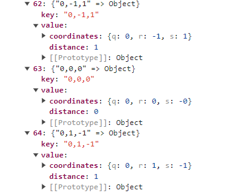
</details>

Creating a grid is simple. <br>

For the hexagon shaped grids you need to input one parameter.
<ol>
<li>Call the function and input the size you want as a parameter. <br>
</ol>

Each 1 point of size represents one ring of cells around the origin point. <br>

<details>
<summary>Hexagon Shape Example</summary>
In this example the grid would have 2 rings around the origin point. <br>

```javascript
const exampleHexGrid = generateHexagonGrid(2)
```

Heres how that would look with if you visually render the grid as a 10, 10 cell size grid. <br>

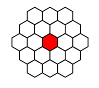

<details>
<summary>Generate Hexagon Grid function</summary>

```javascript
function generateHexagonGrid(gridSize) {
    const grid = new Map();

    for (let q = -gridSize; q <= gridSize; q++) {
        const rStart = Math.max(-gridSize, -q - gridSize);
        const rEnd = Math.min(gridSize, -q + gridSize);

        for (let r = rStart; r <= rEnd; r++) {
            const hex = new HexCubeC(q, r, -q - r);
            const key = `${hex.q},${hex.r},${hex.s}`;

            const distance = hexLength(hex);

            const hexInfo = {
                coordinates: { q: hex.q, r: hex.r, s: hex.s },
                distance
            };
            grid.set(key, hexInfo);
        }
    }
    return grid;
}
```

</details>


</details>

<details>
<summary>Triangle Shape Example</summary>

For the triangle shaped grids you need to input two parameters.
<ol>
<li>Call the function and input the size you want as the first parameter. <br>
<li>Then put the orientation for the second parameter. <br>
</ol>

Each 1 point of size represents one ring of cells around the origin point. <br>
You can put pull the orientation from the Layout class object you made or put it in manually yourself. <br>

Only accepts the four pre-made Orientation class objects. 
<ul>
<li>triangleUp
<li>triangleDown
<li>triangleLeft
<li>triangleRight
</ul>

<details>
<summary>Triangle Shape Example</summary>

In this example the grid would have 2 rings around the origin point and point left. <br>
This is putting the Orientation object class directly.

```javascript
const exampleTriGrid = generateTriangleGrid(2, triangleLeft)
```

Heres how it would look if you pull it from the Layout class object from Step 5.

```javascript
const exampleTriGrid = generateTriangleGrid(2, exampleLayout.orientation)
```

Heres how that would look with if you visually render the left pointing grid as a 10, 10 cell size grid. <br>

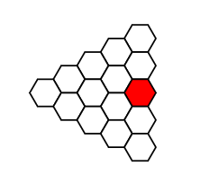

Another example for a grid with 3 rings around the origin point and pointing downwards. <br>

```javascript
const exampleTriGrid = generateTriangleGrid(3, triangleDown)
```

Heres how that would look with if you visually render the downward pointing grid as a 10, 10 cell size grid. <br>


<details>
<summary>Generate Triangle Grid function</summary>

```javascript
function generateTriangleGrid(gridSize, orientation){
    const grid = new Map();
    if (orientation === triangleUp || orientation === triangleDown){
        for (let q = -gridSize; q <= gridSize; q++) {
            for (let r = 0; r <= gridSize - q; r++) {
                const hex = new HexCubeC(q, r, -q - r);
                const key = `${hex.q},${hex.r},${hex.s}`;
    
                const distance = hexLength(hex);
    
                const hexInfo = {
                    coordinates: { q: hex.q, r: hex.r, s: hex.s },
                    distance
                };
                grid.set(key, hexInfo);
            }
        }
    }
    else if (orientation === triangleLeft || orientation === triangleRight){
        for (let r = -gridSize; r <= gridSize; r++) {
            for (let q = 0; q <= gridSize - r; q++) {
                const hex = new HexCubeC(q, r, -q - r);
                const key = `${hex.q},${hex.r},${hex.s}`;
    
                const distance = hexLength(hex);
    
                const hexInfo = {
                    coordinates: { q: hex.q, r: hex.r, s: hex.s },
                    distance
                };
                grid.set(key, hexInfo);
            }
        }
    }
    return grid;
}
```

</details>

</details>


## Quick how to use (with SVG)
With this function, a hexagon grid will be created at in an SVG element. <br>

gridType = Shape of hexagon grid generated. Currently supports triangle shaped grid and hexagon shaped grid. <br>

gridSize = Size of the grid in number of cells. <br>

svgOrigin = The SVG element which is the location of where the grid will be created. <br>

layout = Layout, a class object which contains the data of the orientation of the grid, the size of the individual hexagons and the
location of the origin of the grid. For hexagon shaped grids the origin is the centre of the grid, for triangle grids it is the middle 
of the flat end, opposite the triangles middle point. <br>

(Optional) svgConfig = SvgConfigs, a class object which contains the data for configuring default SVG attributes. Can change fill colour,
stroke colour, stroke width and stroke dash. <br>

(Optional) classConfig = ClassConfigs, a class object which contains the data for configuring the default SVG class name, and can add an id
to each hexagon cell and/or an additional class.<br>

`generateHexGridWithSVG(gridType, gridSize, svgOrigin, layout, svgConfig, classConfig)` <br>

There is an example in the code, which looks like this <br>
`generateHexGridWithSVG(generateHexagonGrid, 6, svg, new Layout(pointyLayout, new Point(10, 10), new Point(250, 250)))` <br>
This will create a hexagon shaped grid with hexagon cells. <br>

The grid size is 6. This results in 6 rows of hexagon cells around its origin point. <br>

The orientation of the layout is pointyLayout. This results in the hexagon cells pointing upwards. <br>

The size of the layout is 10(x), 10(y). This results in regular shaped hexagon. <br>

The origin of the layout is 250, 250. This results in the origin of the grid being placed right in the middle of the 500, 500 SVG element in this example. <br>